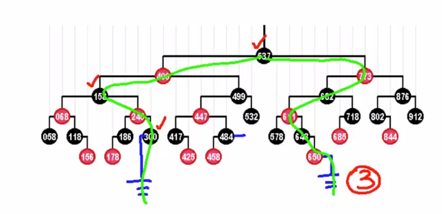
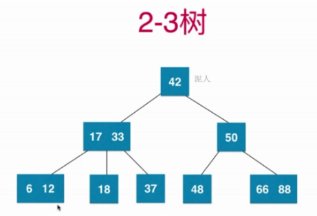
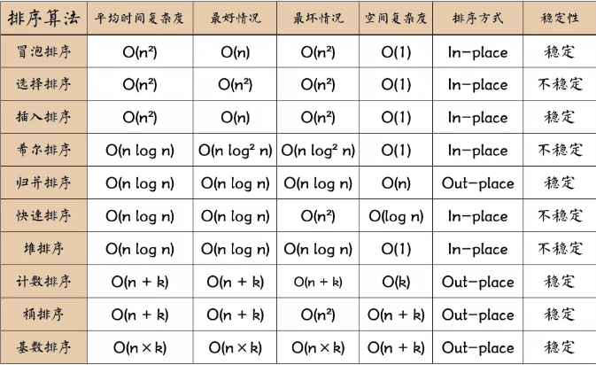
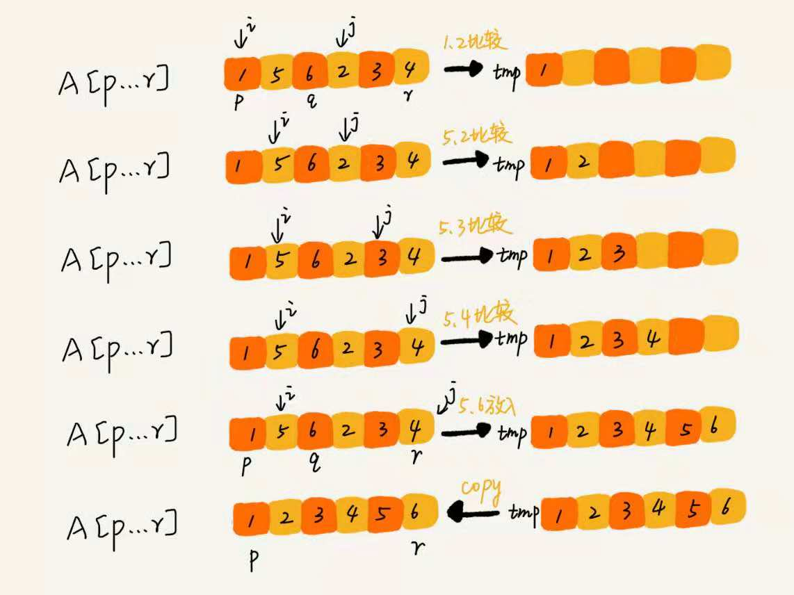
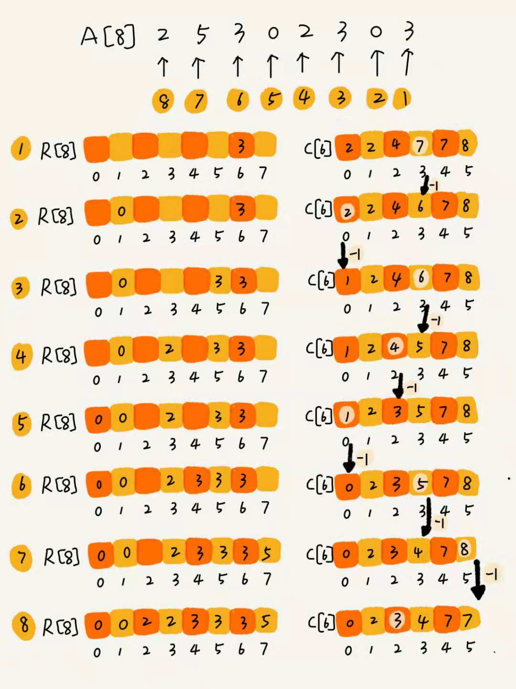
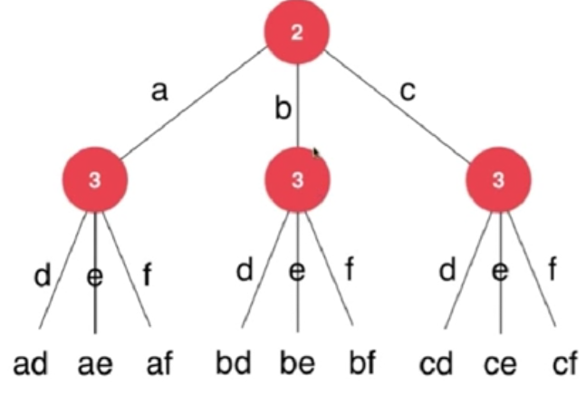
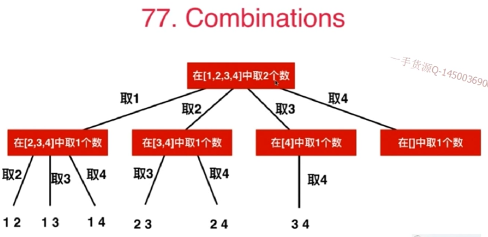

# 记录和总结数据结构与算法相关内容
###主要实践为leetcode，剑指offer，各大公司笔试，面试题。

本仓库主要用于学习数据结构与算法，同时作为笔试、面试刷题积累，主要用于提升自身的编程能力。在自己思考的基础之上融入高手们的编程思想，做好详细记录。

## 如何写出正确的程序？ ##

- 明确变量的含义
- 循环不变量
- 小数据量调试
- 大数据量的测试

增加一个文件夹leetcode，用于记录数据结构与算法相关的完成代码。主要分为Array，链表，栈，队列，二叉树，图，排序，递归，贪心，分治，动态规划，回溯。

# 一、数组 #
数组是一种线性表数据结构，用一组**连续的内存空间**来存储一组具有**相同类型**的数据。其最大特点是支持随机访问，但删除，插入操作低效。
数组在定义时需要预先指定大小，因为需要分配连续的内存空间。
Java中的ArrayList支持动态扩容，当存储空间不够时，其空间自动扩容为1.5倍大小。
## 数组的基本操作 ##
- Insert--在指定索引插入一个元素
- Get--返回指定索引的元素
- Delete--删除指定索引位置的元素
- Size--数组所有元素的数量
## 数组常见问题 ##
- 二分查找，注意二分查找的实现
- 寻找数组中的第二小的元素
- 找到数组中第一个不重复出现的整数
- 合并两个有序数组
- 重新排列数组中的正值和负值
- 连续子数组的和
- 顺时针打印矩阵

leetcode 283. Move Zeroes

leetcode 27. Remove Element

leetcode 26. Remove Duplicates from Sorted 

letcode 80. Remove Duplicates from Sorted Array II

leetcode 75. Sort Colors

leetcode 88. Merge Sorted Array

leetcode 215. Kth Largest Element in an Array

leetcode 125. Valid Palindrome

leetcode 345. Reverse Vowels of a String

leetcode 11. Container With Most Water

## 双索引技术 ##

leetcode 209. Minimum Size Subarray Sum

滑动窗口法。

leetcode 3. Longest Substring Without

leetcode 438.Find All Anagrams in a String   

leetcode 76. Minimum Window Substring  

# 二、链表 #
链表包括单链表、双向链表以及循环链表
## 链表的基本操作 ##
- InsertAtEnd 在链表的尾部插入指定元素
- InsertAtHead 在链表的头部插入指定元素
- Delete 从链表删除指定元素
- DeleteAtHead 删除链表的第一个元素
- Search 从链表中返回指定元素
- isEmpty 如果链表为空，则返回true
## 链表常见问题 ##
- 1.反转链表  
- 2.检查链表中的循环
- 3.返回链表中倒数第N个节点
- 4.删除链表中的重复项
-5合并两个排序的链表

# 三、查找表 #

# 四、栈 #
LIFO(后进先出)
## 栈的基本操作 ##
- Push 在栈顶插入一个元素
- Pop 返回并移除栈顶元素
- isEmpty 若栈为空，则返回true
- Top 返回顶部元素，但并不移除
## 栈常见问题 ##
- 1.使用栈计算后缀表达式
- 2.对栈元素进行排序
- 3.判断表达式是否括号平衡
- 4.包含min函数的栈
-5 栈的压入和弹出

# 五、队列 #
FIFO(先进先出)
## 队列的基本操作 ##
- Enqueue 在队列尾部插入元素
- Dequeue 在移除队列头部的元素
- isEmpty 如果队列为空则返回true
- Top 返回队列第一个元素
## 队列常见问题 ##
- 1.使用队列表示栈
- 2.对队列的前K个元素倒序
- 3.使用队列生成1~n的二进制数
- 4.用两个栈实现队列

    
# 六、树 #
树形结构是一种层次式的数据结构，由顶点和边组成，但不存在回路

## 树形结构的主要类型包括 ##
- N元树
- 平衡树

高度差小于1

- 二叉树
- 二叉搜索树
- AVL树
- B树

平衡多路搜索树，批量访问。所谓m阶B树，即多路平衡二叉搜索树(m>=2)。
外部节点的深度统一相等，所有叶节点的深度统一相等。

## 红黑树 ##

- 1.树根必为黑色，
- 2.外部节点(空的叶节点)均为黑色，
- 3.其余节点若为红色则只能有黑孩子，也就是红节点的孩子和父亲都是黑节点，
- 4.外部节点到根节点黑节点数目相等，外部节点实际是假想的。

  
 

性质：黑平衡二叉树(绝对平衡)，不是平衡二叉树，最大高度(2lgn),O(lgn)。

## 2-3树 ##
- 满足二分搜索树的基本性质
- 节点可以存放一个元素或者两个元素
- 可以存放两个孩子也可以存放三个孩子

  
 

**性质**

2-3树是一个绝对平衡的树。

**红黑树与2-3树的等价性**：红黑树中的红节点实际是2-3树中与父节点构成三节点。

对应上图中的2-3树表示为红黑树如下图所示

  
 

- 哈夫曼树

特点：1.没有度为1的结点，2.n个叶子结点的哈夫曼树共有2*n-1个结点。3.左右子树交换后依然是哈夫曼树。WPL相同的两可树为同构哈夫曼树。

## 树常见问题 ##
-1.求二叉树的深度
-2.树的子结构
-3.镜像二叉树    
-4.在二叉搜索树中查找第k个最大值
-5.查找与根节点距离K的节点
-6.在二叉树中查找给定节点的祖先节点
-7.重建二叉树
-8.从上往下打印二叉树(树的层次遍历，一半借用队列来实现)
-9.二叉树的和为某一值的路**

## 堆 ##
堆也称为优先队列，堆必须是完全二叉树。
## 最大堆常见操作 ##
- MaxheapCreate 创建一个空的最大堆
- IsFull 判断最大堆是否已满
- Insert 将元素item插入最大堆
- IsEmpty 判断最大堆H是否为空
- DeleteMax 返回最大元素

## 字典树 ##
字典树，也称为前缀树，对于解决字符串问题非常有效。
## 字典树常见问题 ##
- 计算字典树中的总单词树
- 打印存储在字典树中的所有单词
- 使用字典树对数组的元素进行排序
- 使用字典树从字典中形成单词
- 构建T9字典（字典树 + DFS）

# 七.图 #
图是一组以网络形式相互连接的节点。节点也称为顶点，顶点之间的线称为边。
包含有向图和无向图

## 图的表示方式 ##
- 邻接表
- 邻接矩阵

## 常见图遍历算法 ##
- 广度优先搜索(BFS)类似于树的层次遍历。

类似于树的层次遍历，使用队列来存储遍历过的顶点，判断弹出的顶点的每个顶点是否被遍历，如果没有遍历，则遍历后存入**队列**。

时间复杂度与深度优先遍历相同。

- 深度优先搜索(DFS)

类似于于树的先序遍历

定义一个标记数组，判断邻接点是否被遍历？分别判断与当前邻接点相连的接点是否被遍历。

N个顶点，E条边的时间复杂度：**1.用邻接表存储图，有O(N+E)2.邻接矩阵存储图O(N^2)。**

## 图常见问题 ##
- 实现广度和深度优先搜索
- 检查图是否为树
- 计算图的边数
- 找到两个顶点之间的最短路径

# 八.哈希表 #
对象以键值对形式存储，存在唯一索引
哈希表通常使用数组实现

## 哈希表常见问题 ##
- 在数组中查找对称键值对
- 追踪遍历完整路径
- 查找数组是否是另一个数组的子集
- 检查给定数组是否相交

# 九.排序算法 #
知识点来源《算法》、《数据结构与算法之美--极客时间王争》

**十大排序算法的性能比较如下图所示**

  
 

常见排序算法：
时间复杂度(O(n^2)):冒泡排序、插入排序、选择排序;

时间复杂度(O(nlogn):希尔排序、归并排序、快速排序;

时间复杂度(O(n)):计数排序、基数排序、桶排序。不进行比较。

**问题1：插入排序与冒泡排序时间复杂度相同，为什么更倾向于插入排序。**

代码实现时，冒泡数据移动需要3k时间单位，插入只需要K时间单位，插入排序时间更少。

分析一个排序算法的三个方面：

1.算法执行效率(时间复杂度、时间复杂度的系数，常数，比较次数)。

2.内存消耗(空间复杂度，前三种为原地排序算法)。

3.排序算法的稳定性(相同数字排序前后位置不变，为稳定)。

## 1.冒泡排序 ##

冒泡排序只涉及相邻数据的交换操作，是一个原地操作，不改变两个相同元素的位置，所以是**稳定算法**。时间复杂度：最好为一次冒泡O(n)，最坏为倒序O(n^2)。

  
 

    public static void BubbleSort(int [] arr){
         boolean flag = false;//优化冒泡排序算法，如果不发生交换则停止冒泡
        for(int i=0;i<arr.length;i++){
            for(int j = 0;j<arr.length-1-i;j++) {
                if (arr[j] > arr[j + 1]) {
                    Sort.swap(arr, j, j + 1);
                    flag = true;
                }
            }
            if(!flag){
                break;//已排好序，提前退出
            }
        }
    }

## 2.插入排序 ##

插入排序的核心思想，去未排序区间的元素，在已经排序的区间找到合适位置将其插入。
插入排序是原地算法，可以保持**稳定性**，时间复杂度：最好(O(n)),最坏O(n^2),平均时间复杂度O(n^2)。

  
 

  public static void InsertSort(int[] arr){

        //初始的第一个元素已经排序，所以从下标为元素开始
        for(int i=1;i<arr.length;i++){
            int value = arr[i];//取每一个未排序元素并用value保存
            int j = i-1;
            for(;j>=0;j--){//从已排序的最后一个元素开始比较
                if(value < arr[j]){
                    arr[j+1] = arr[j];//向后移动数据
                }else{
                    break;//找到插入位置，跳出循环
                }
            }
            arr[j+1] = value;
        }
    }

## 3.选择排序 ##

选择排序也分为已排序区间和为排序区间，但选择排序每次会从未排序找到最小元素，将其排序放在已排序最后。不稳定。

  
 

 public static void SelectSort(int[] arr){

        for(int i=1;i<arr.length;i++){
            int minindex = i;//每趟遍历之前最小值下标记性保存
            int j = i+1;//在后面未排序中查找最小的
            for(;j<arr.length;j++){
                if(arr[j] < arr[minindex]){
                    minindex = j;//记录最小值下标
                }
            }
            Sort.swap(arr,i,j);
        }
    }

## 4.希尔排序 ##

希尔排序是插入排序的优化，第一批冲出时间复杂度为O(n^2)的排序算法，最好时间复杂度为O(n),平均和最坏时间复杂度为O(nlogn)。

  
 

   public static void ShellSort(int[] arr){

        int i,j,gap;
        for (gap = arr.length/2;gap>0;gap/=2){
            for(i=gap;i<arr.length;i++){
                for(j = i-gap;j>=0 && arr[j] > arr[j+gap];j -= gap){
                    Test.swap(arr,j,j+gap);
                }
            }
        }
    }

归并排序和快速排序都借助了分治的思想。

**问题2：如何在O(n)时间复杂度找出无序数组中第K大元素？**

## 5.归并排序 ##
归并排序的核心思想就是在数组从中间分成前后两部分，然后再将前后两部分进行分别排序，最后将两部分合并，即分而治之。将一个大问题分解为小问题，先解决小问题，那么大问题就是解决了。分治是一种思想，而递归是一种编程技巧，分治就是通过递归来实现的。

写递归代码的技巧就是，分析得出递推公式，找到终止条件，最后将递推公式翻译成代码。

归并排序**是稳定的**，时间复杂度是最好、最坏、平均都是O(nlogn),由于在合并时，需要临时数组，所以归并排序**不是原地排序算法**，空间复杂度为O(n)。

  
 

  
 

合并图解

  
 
/*********************************************************************/

    //归并算法start
    public static void mergeSort(int[] arr){
        //调用一个递归辅助函数
        mergeSorthelper(arr,0,arr.length-1);
    }

    //递归分而辅助函数
    public static void mergeSorthelper(int[] arr,int left,int right){
        //首先指定递归终止条件
        if (left >= right){
            return;
        }
        int mid = left + (right-left)/2;
        mergeSorthelper(arr,left,mid);
        mergeSorthelper(arr,mid+1,right);

        merge(arr,left,mid,right);
    }
    //定义治之合并函数
    public static void merge(int[]arr,int left,int mid,int right){
        int i = left;//左半部起点
        int j = mid+1;//右半部起点
        int k = 0;//初始变量用于临时数组下标
        int[] temp = new int[right-left+1];
        //将两部分元素进行比较
        while(i<=mid && j<=right){
            //等号保证稳定性
            if(arr[i] <= arr[j]){
                temp[k++] = arr[i++];
            }else{
                temp[k++] = arr[j++];
            }
        }
        //退出while循环，查看那部分还有剩余元素，假定左半部分有
        int start = i;
        int end = mid;
        //如果是右半部分有则更新起止元素
        if(j <= right){
            start = j;
            end = right;
        }

        //将剩余元素放入临时数组等号不可忽略
        while (start <= end){
            temp[k++] = arr[start++];
        }
        //将临时数组中的元素返回给原数组arr，因为初始right = arr.length-1，所以必须加入等号
        for(i=0;i<=right - left;i++){
            //这里犯了一个小错误,必须为left+i，因为随着递归的进行右半部分并不全是是从0开始
            arr[left + i] = temp[i];
        }
    }

    //归并算法end
   /************************************************************************************/

## 6.快速排序 ##

核心思想：确定一个基准(第一个和最后一个最常用，我这里采用最后一个最为基准pivot)。找到基准之后进行分片，前半部分小于这个基准，后半部分大于这个基准，然后按照这个思想继续递归。递归终止条件为数据无法继续分片，找基准点需要通过设置前后哨兵来进行。

快速排序是一种原地(原本需要两个临时数组，但是经过巧妙设计分区点则可以是原地排序)，**不稳定的排序算法**，时间复杂度：最好是O(nlogn),平均为O(nlogn),极端情况下会退化为O(n^2)。

**归并排序和快速排序的区别**

  
 

归并排序的空间时间复杂度是O(n),且不是原地排序算法，且快速排序时间复杂度退化为O(n^2)。所以常用快速排序。

//快速排序start
   /**********************************************************/

    public static void quickSort(int[] arr){
       quickSorthelper(arr,0,arr.length-1);
     }

 

    public static void quickSorthelper(int[]arr,int left,int right){
       if(left >= right){
           return;
       }
        int p = partition(arr,left,right);//得到分区点
        quickSorthelper(arr,left,p-1);//左半部分递归
        quickSorthelper(arr,p+1,right);
    }
    //定义分片函数partiiton
    public static int partition(int[]arr,int left,int right){
        int i = left ;//左哨兵
        int j = right;//右哨兵
        int pvoit = arr[right];//选择最后的元素为基准

        //这种找分片点的方法不太好
        for(int j = left;j<right;j++){
           if(arr[j] < pvoit) {
             Sort.swap(arr, i, j);
                i++;
           }
       }
        Sort.swap(arr,i,right);
      return i;
        //这样更加容易看懂
        while (i != j){
            if(arr[i] < pvoit){
                i++;
            }
            else if(arr[j] > pvoit){
                j--;
            }else {
                 Sort.swap(arr,i,j);
                 i++;
            }
        }
        Sort.swap(arr,i,right);
        return i;
    }

   /**************************************************************/

接下来三种算法时间复杂度是O(n),因此称之为线性排序，这三中排序都是基于非比较的排序算法，不涉及元素之间的比较。这几种算法虽然简单，但是对数据要求较高。

**问题3：如何根据年龄给100万用户排序？**

## 7.桶排序 ##

桶排序的核心思想：将要排序的数据分到几个有序的桶里，桶内排序之后，每个桶里的数据按照顺序依次取出，组成的序列就是有序的。每个桶内使用快速排序。当极端情况下，数据都被分到一个桶里时，桶排序就退化为O(nlogn)。

当数据量比较大，存储在磁盘中，无法加载至内存(外部排序)，就可以采用桶排序。

  
 

## 8.计数排序 ##

计数排序中的数据必须都是整数。计数排序的核心思想是首先计算相同元素的个数。由于要排序元素作为计数数组的下标，那么如果将计数数组的值进行累计，即可得到小于等于某个数的个数。然后从后往前遍历需要排序的数组，将数组的值的个数减1即可得到排序数组下标。

  
 

   //计数排序

    public static void countingSort(int []arr){
        if(arr.length < 1){
            return ;
        }

        //找出数组中最大数值

        int max = arr[0];
        for(int i=1;i<arr.length;i++){
            if(arr[i] > max){
                max = arr[i];
            }
        }

        //根据max申请一个大小为max+1的桶
        int[] count = new int[max+1];
        //初始化为0
        for(int i=0;i<max+1;i++){
            count[i] = 0;
        }

        //记录每个元素的个数

        for(int i=0;i<arr.length;i++){
            count[arr[i]]++;
        }

        //对count数组的元素顺序求和
        for (int i=1;i<max+1;i++){
            count[i] = count[i-1] + count[i];
        }

        //新建临时数组存放排序结果
        int[] rank = new int[arr.length];
        //因为count数组是累加计数，所以从后往前遍历数组arr
        for(int i=arr.length-1;i>=0;i--){
            int index = count[arr[i]] -1;//arr[i]在排序数组中的下标
            rank[index] = arr[i];
            count[arr[i]]--;//排序一个就减少一个
        }

        //将排好序的元素放回arr数组
        for(int i=0;i<arr.length;i++){
            arr[i] = rank[i];
        }
    }

个人感觉计数排序更加适合重复元素比较多的整数情况。

## 9.基数排序 ##

- 将所有待比较的数值(正整数)统一为同样的数位长度，数位较短的数前面补0
- 从低位开始，一次进行一次排序
- 最低位排序一直到最高位，数列就变得有序了。

  
 

## 10.堆排序 ##

- 创建一个堆H[0,...,N-1];
- 把堆首与堆尾互换
- 将堆的尺寸减小1，并调用向下调整函数。
- 重复步骤2.

  
 

# 十、字符串 #

# 十一、动态规划 #

递归+记忆化搜索(类似)
将原问题拆解成若干子问题，同时保存子问题的答案，使得每个子问题只求解一次。最终获得原问题的答案。

# 十二、分治 #
# 十三、贪心 #

## leetcode 455 分饼干 ##
将最大的饼干首先分配给最贪心的小朋友，如果满足则分配，否则分配给次贪心的小朋友。贪心算法一般都需要排序。

## leetcode 392 判断子序列 ##

## 动态规划与贪心之间的关系 ##

# 十四、递归与回溯 #

树形问题

17. Letter Combinations of a Phone Number

digits是数字字符串

s(digits)是digits所能代表的字母字符串

递归调用：

s(digits[0...n-1) = letter(digits[0]) + s(digits[1...n-1])
=letter(digits[0]) + letter(digits[1]) + s(digits[2...n-1])=...。

  
 

递归调用结束时，需要进行回溯。

假设数字长度为n，时间复杂度为O(3^n)。

93. Restore IP Addresses

131. Palindrome Partitioning    

## 回溯算法的应用 ##

### 1.排列问题

46. Permutations

  
 

递推公式：Perms(nums[0...n-1])={取出一个数字} + Perms(nums[{0...n-1}-这个数字])

47. Permutations II  

###组合问题

77 Combinations  

  
 

回溯法剪枝：不需要取4。

39. Combination Sum

40. Combination Sum II

216. Combination Sum III

78. Subsets

90. Subsets II

401. Binary Watch

### 二维平面上使用回溯法

79 Word Search

### floodfill算法(其实质是深度优先遍历)

200. Number of Islands

# 海量数据案例 #

