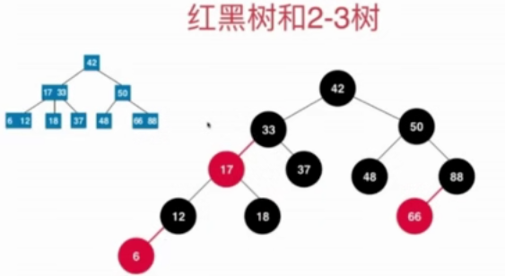
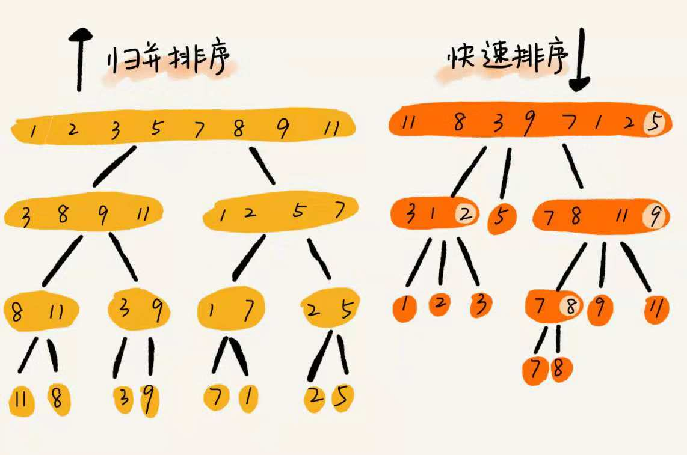
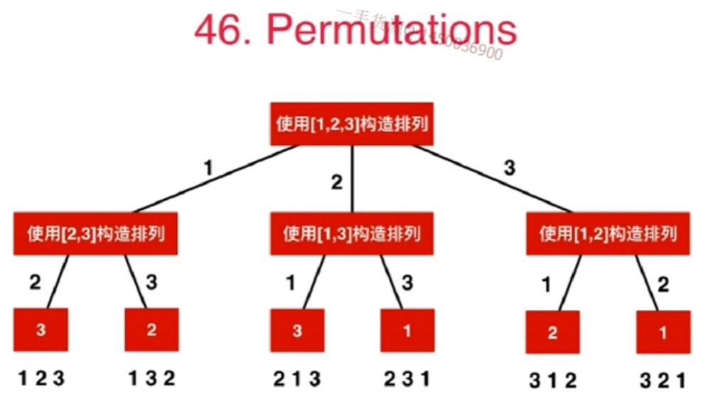

# 记录和总结数据结构与算法相关内容
###主要实践为leetcode，剑指offer，各大公司笔试，面试题。

本仓库主要用于学习数据结构与算法，同时作为笔试、面试刷题积累，主要用于提升自身的编程能力。在自己思考的基础之上融入高手们的编程思想，做好详细记录。

## 如何写出正确的程序？ ##

- 明确变量的含义
- 循环不变量
- 小数据量调试
- 大数据量的测试

## 时间复杂度分析与空间复杂度分析

增加一个文件夹leetcode，用于记录数据结构与算法相关的完成代码。主要分为Array，链表，栈，队列，二叉树，图，排序，递归，贪心，分治，动态规划，回溯。

# 一、数组 #
数组是一种**线性表数据结构**，用一组**连续的内存空间**来存储一组具有**相同类型**的数据。其最大特点是**支持随机访问**，但删除，插入操作低效。
数组在定义时需要预先指定大小，因为需要分配连续的内存空间。
Java中的ArrayList支持动态扩容，当存储空间不够时，其空间自动扩容为1.5倍大小。

数组和链表的区别？

数组按照下标访问时，其时间复杂度是O(1),插入元素的时间复杂度是O(n),链表适合插入和删除数据，时间复杂度为O(1)。
## 数组的基本操作 ##
- Insert--在指定索引插入一个元素
- Get--返回指定索引的元素
- Delete--删除指定索引位置的元素
- Size--数组所有元素的数量
## 数组常见问题 ##
- 二分查找，注意二分查找的实现
- 寻找数组中的第二小的元素
- 找到数组中第一个不重复出现的整数
- 合并两个有序数组
- 重新排列数组中的正值和负值
- 连续子数组的和
- 顺时针打印矩阵

leetcode 283. Move Zeroes

leetcode 27. Remove Element

leetcode 26. Remove Duplicates from Sorted 

letcode 80. Remove Duplicates from Sorted Array II

leetcode 75. Sort Colors

leetcode 88. Merge Sorted Array

leetcode 215. Kth Largest Element in an Array

leetcode 125. Valid Palindrome

leetcode 345. Reverse Vowels of a String

leetcode 11. Container With Most Water

34. 在排序数组中查找元素的第一个和最后一个位置

## 双索引技术 ##

15. 三数之和

	    class Solution {

	    public List<List<Integer>> threeSum(int[] nums) {
	        List<List<Integer>> res = new ArrayList<>();
	        Arrays.sort(nums);
	        for(int i=0;i<=nums.length-2;i++){ 

	            if(i>0 && nums[i]==nums[i-1]){
	                continue;
	            }
	            //设置双指针
	            int left = i+1;
	            int right = nums.length-1;
	            while(left<right){
	                if(nums[i] + nums[left] +nums[right] < 0){
	                    left++;
	                }
	                else if(nums[i] + nums[left] +nums[right] > 0){
	                    right--;
	                }
	                else{
	                    res.add(Arrays.asList(nums[i],nums[left],nums[right]));
	                    //防止相等元素，导致结果重复
	                    while(left < nums.length-1 && nums[left] == nums[left+1]){
	                        left++;
	                    }
	                    //防止相等元素，导致结果重复
	                    while(right > 0 && nums[right] == nums[right-1]){
	                        right--;
	                    }
	                    left++;
	                    right--;
	                }
	            }
	        }
	        return res;
	        
	    }
	}

leetcode 209. Minimum Size Subarray Sum

## 滑动窗口法。

leetcode 3. Longest Substring Without

leetcode 438.Find All Anagrams in a String   

leetcode 76. Minimum Window Substring  

## 二分查找(运行效率还不如for循环)

34. 在排序数组中查找元素的第一个和最后一个位置

	public int[] searchRange(int[] nums, int target) {

	        if(nums.length==0||nums == null){
	            return new int[]{-1,-1};
	        }
	        int start = findFirst(nums,target);
	        if( start == -1){
	            return new int[]{-1,-1};
	        }
	        return new int[]{start,findLast(nums,start,target)};
	    }
	    public int findFirst(int[] nums,int target){
	        int left = 0;
	        int right = nums.length-1;
	        while(left < right){
	           int mid = left + (right-left)/2;
	           if(nums[mid]==target){
	               right = mid;
	           }
	           else if(nums[mid]<target){
	               left = mid+1;
	           }else{
	               right = mid-1;
	           }
	        }
	        return nums[left] == target? left:-1;
	    }
	    public int findLast(int[] nums,int num,int target){
	        int left = num;
	        int right = nums.length-1;
	        while(left < right){
	           int mid = left + (right-left+1)/2;
	           if(nums[mid]==target){
	               left = mid;
	           }
	           else if(nums[mid]<target){
	               left = mid+1;
	           }else{
	               right = mid-1;
	           }
	        }
	        return nums[left] == target? left:-1;
	    }

	class Solution {
	    public int[] searchRange(int[] nums, int target) {
	        
	       int first = -1;
	       int i = 0; 
	       for(;i<nums.length;i++){
	           if(nums[i] == target){
	               first = i;
	               break;
	           }
	       }
	       if(first == -1){
	           return new int[]{-1,-1};
	       }
	       int count = -1;
	       for(int j = i;j<nums.length;j++){
	           if(nums[j] == target){
	               count++;
	           }
	       }
	       return new int[]{first,first+count};
	       
	    }
	}

# 二、链表 #
链表包括单链表、双向链表以及循环链表
## 链表的基本操作 ##
- InsertAtEnd 在链表的尾部插入指定元素
- InsertAtHead 在链表的头部插入指定元素
- Delete 从链表删除指定元素
- DeleteAtHead 删除链表的第一个元素
- Search 从链表中返回指定元素
- isEmpty 如果链表为空，则返回true
## 链表常见问题 ##
- 1.反转链表  
- 2.检查链表中的循环
- 3.返回链表中倒数第N个节点
- 4.删除链表中的重复项
-5合并两个排序的链表

# 三、查找表 #

map+set

350. 两个数组的交集 II

242. 有效的字母异位词

202. 快乐数

290. 单词模式

205. 同构字符串

451. 根据字符出现频率排序

1. 两数之和

15. 三数之和

16. 最接近的三数之和

454. 四数相加 II

18. 四数之和

49. 字母异位词分组

447. 回旋镖的数量

## 滑动窗口+查找表

219. 存在重复元素 II

217. 存在重复元素

220. 存在重复元素 III

# 四、栈 #
LIFO(后进先出)
## 栈的基本操作 ##
- Push 在栈顶插入一个元素
- Pop 返回并移除栈顶元素
- isEmpty 若栈为空，则返回true
- Top 返回顶部元素，但并不移除
## 栈常见问题 ##
- 1.使用栈计算后缀表达式
- 2.对栈元素进行排序
- 3.判断表达式是否括号平衡
- 4.包含min函数的栈
-5 栈的压入和弹出

# 五、队列 #
FIFO(先进先出)
## 队列的基本操作 ##
- Enqueue 在队列尾部插入元素
- Dequeue 在移除队列头部的元素
- isEmpty 如果队列为空则返回true
- Top 返回队列第一个元素
## 队列常见问题 ##
- 1.使用队列表示栈
- 2.对队列的前K个元素倒序
- 3.使用队列生成1~n的二进制数
- 4.用两个栈实现队列

##附加：跳表(Redis利用跳表实现有序集合Sorted Set)
    
# 六、树 #
树形结构是一种层次式的数据结构，由顶点和边组成，但不存在回路

## 树形结构的主要类型包括 ##
- N元树
- 平衡树

高度差小于1

## 二叉树
114. 二叉树展开为链表

	class Solution {
	    TreeNode prev = null;
	    public void flatten(TreeNode root) {
	        if(root == null){
	            return;
	        }
	        flatten(root.right);//先递归到最右边，在回溯
	        flatten(root.left);
	        
	        root.right = prev;//将当前节点的右指针指向prev
	        root.left = null;//左指针置为null
	        prev = root;//更新prev
	    }
	}

94. 二叉树的中序遍历(非递归解法，递归解法较简单)

	class Solution {

	    public List<Integer> inorderTraversal(TreeNode root) {
	        
	        List<Integer> res = new ArrayList<>();
	        Stack<TreeNode> stack = new Stack<>();
	        TreeNode cur  = root;
	        while(cur != null || !stack.isEmpty()){
	            while(cur!=null){
	                stack.push(cur);
	                cur = cur.left;
	            }
	            cur = stack.pop();
	            res.add(cur.val);
	            cur = cur.right;
	        }
	        return res;
	    }
	}

102. 二叉树的层次遍历

	class Solution {

	    public List<List<Integer>> levelOrder(TreeNode root) {
	        Queue<TreeNode> queue = new LinkedList<TreeNode>();
	        List<List<Integer>> res = new ArrayList<List<Integer>>();
	        if(root == null){
	            return res;
	        }
	        queue.offer(root);
	        while(!queue.isEmpty()) {
	            int size = queue.size();
	            List<Integer> list = new ArrayList<>();
	            
	            while(size > 0){
	                TreeNode temp = queue.poll();
	                if(temp.left != null){
	                    queue.offer(temp.left);
	                }
	                if(temp.right != null){
	                    queue.offer(temp.right);
	                }
	                list.add(temp.val);
	                size--;
	            }
	            res.add(list);
	        }
	        return res;
	    }
	}

124. 二叉树中的最大路径和

	class Solution {
	    
	    int max = Integer.MIN_VALUE;
	    public int maxPathSum(TreeNode root) {
	        helper(root);
	        return max;
	    }
	    
	    public int helper(TreeNode root){
	        if(root == null){
	            return 0;
	        }
	        //左边最大
	        int left = Math.max(0,helper(root.left));
            //右边最大
	        int right = Math.max(0,helper(root.right));
            //加上根节点
	        max = Math.max(max,(left+right+root.val));
	        return Math.max(left,right)+root.val;
	    }
	}

### 二叉搜索树

235. 二叉搜索树的最近公共祖先

    public class LowestCommonAncestorofaBinarySearchTree235 {

    public TreeNode lowestCommonAncestor(TreeNode root, TreeNode p, TreeNode q) {

        if(root == null || root == p|| root == q){
            return root;
        }

        //如果p、q在二叉搜索树的两边，那么root就是他们的公共祖先
        if(((root.val > p.val)&&(root.val < q.val))||((root.val < p.val)&&(root.val > q.val))){
            return root;
        }
        //如果p，q在root的左边则递归调用左子树
        if((root.val > p.val)&&(root.val > q.val)){
            return lowestCommonAncestor(root.left,p,q);
        }else{
            //否则调用右子树
            return lowestCommonAncestor(root.right,p,q);
        }

    }
    }

98. 验证二叉搜索树

    class Solution {
    public boolean isValidBST(TreeNode root) {
        
        return helper(root,null,null);
    }
    
    public boolean helper(TreeNode root,TreeNode left,TreeNode right){
        if(root == null){
            return true;
        }
        if(left != null && left.val <= root.val){
            return false;
        }
        if(right !=null&& right.val >= root.val){
            return false;
        }
        //不断递归左右子树
        return helper(root.left,root,right)&&helper(root.right,left,root);
    }
    }

108. 将有序数组转换为二叉搜索树

按照根左右二分之。

     public class ConvertSortedArraytoBinarySearchTree108 {
    public TreeNode sortedArrayToBST(int[] nums) {

        return CreateTree(nums,0,nums.length-1);

    }

    TreeNode CreateTree(int[] nums,int l,int r ){
        if(l>r) return null;
        int mid = (l+r+1)/2;
        TreeNode node = new TreeNode(0);

        node.val = nums[mid];
        node.left = CreateTree(nums,l,mid-1);
        node.right = CreateTree(nums,mid+1,r);
        return node;
    }
    }

450. 删除二叉搜索树中的节点

    public TreeNode deleteNode(TreeNode root, int key) {
        
        
        if(root == null){
            return null;
        }
        
        if(root.val == key){
            if(root.left == null){
                return root.right;
            }
            if(root.right == null){
                return root.left;
            }
            
            TreeNode node = root.right;
            while(node.left!=null){
                node = node.left;
            }
            node.left = root.left;
            return root.right;
        }
        
        else if(root.val < key){
            TreeNode  node = deleteNode(root.right,key);
            root.right = node;
            return root;
        }else{
            TreeNode node = deleteNode(root.left,key);
            root.left = node;
            return root;
        }
        
    }
    }

230. 二叉搜索树中第K小的元素

*
 * 中序遍历
 */
    public class KthSmallestElementinaBST {

    int index=0;

    public int kthSmallest(TreeNode root, int k) {

        int res = 0;
        if(root == null){
            return res;
        }

        res = kthSmallest(root.left,k);
        if(index == k){
            return res;
        }
        if(++index == k){
            return root.val;
        }
        res = kthSmallest(root.right,k);

        return res;

    }
    }

538. 把二叉搜索树转换为累加树
后序遍历(右+root为root，再left)

	class Solution {
	    int sum = 0;
	    public TreeNode convertBST(TreeNode root) {
	        if(root == null){
	            return null;
	        }
	        convertBST(root.right);
	        sum = sum + root.val;
	        root.val = sum;
	        convertBST(root.left);
	        return root;
	    }
	}

### 平衡二叉树

110. 平衡二叉树

    class Solution {
    public boolean isBalanced(TreeNode root) {
        
        if(root == null){
            return true;
        }
        if(Math.abs(getDepth(root.left) - getDepth(root.right)) > 1){
            return false;
        }
        return isBalanced(root.left)&&isBalanced(root.right);//要递归遍历所有结点的左右节点深度差
    }
    
    public int getDepth(TreeNode root){
        //int depth = 0;
        if(root == null){
            return 0;
        }
        
        return Math.max(getDepth(root.left),getDepth(root.right))+1;
    }
    }

### B树

平衡多路搜索树，批量访问。所谓m阶B树，即多路平衡二叉搜索树(m>=2)。
外部节点的深度统一相等，所有叶节点的深度统一相等。

**规则：**

1. 排序方式：所有节点关键字是按递增次序排列，并遵循左小右大原则。
2. 子节点数：非叶子节点数>1,且<=M。(M阶代表一个树节点最多有多少个查找路径，M>=2,M=M路，当M=2则是二叉树，M=3则是三叉树)。
3. 关键字数：子节点的关键字数量大于等于ceil(m/2)-1个且小于等于M-1个(ceil()是个朝正无穷方向取整的函数 如ceil(1.1)结果为2)。
4. 所有叶子节点均在同一层、叶子节点除了包含关键字和关键字记录的指针外也有指向其子节点的指针，只不过其指针地址都为null对应下图最后一层节点的空格子。
5. 有j个孩子的非页节点恰好有j-1个关键码，关键码按递增次序排列。

### B+树

在B+树中，所有记录节点都是按键值大小顺序存放在同一层的叶子节点上，由各叶子节点指针进行连接。

**规则**：
1. B+树跟B树不同的是B+树的非叶子节点不保存关键字记录的指针，只进行数据索引，这样使得B+树每个非叶子节点所能保存的关键字大大增加。
2. B+树叶子节点保存了父节点的所有关键字记录的指针，所有数据地址必须要用到叶子节点才能获取到。所以每次数据查询的次数都一样。
3. B+树叶子节点的关键字从小到大有序排列，左边结尾数据都会保存右边节点开始数据的指针。
4. 非叶子节点的子节点数=关键字数，也可以说非叶子节点数=关键数-1。

### 红黑树 ##

- 1.树根必为黑色，
- 2.外部节点(空的叶节点)均为黑色，
- 3.其余节点若为红色则只能有黑孩子，也就是红节点的孩子和父亲都是黑节点，
- 4.外部节点到根节点黑节点数目相等，外部节点实际是假想的。

  
 

性质：黑平衡二叉树(绝对平衡)，不是平衡二叉树，最大高度(2lgn),O(lgn)。

### 2-3树 ##

- 满足二分搜索树的基本性质
- 节点可以存放一个元素或者两个元素
- 可以存放两个孩子也可以存放三个孩子

  
 

**性质**

2-3树是一个绝对平衡的树。

**红黑树与2-3树的等价性**：红黑树中的红节点实际是2-3树中与父节点构成三节点。

对应上图中的2-3树表示为红黑树如下图所示

  
 

- 哈夫曼树

特点：1.没有度为1的结点，2.n个叶子结点的哈夫曼树共有2*n-1个结点。3.左右子树交换后依然是哈夫曼树。WPL相同的两可树为同构哈夫曼树。

## 树常见问题 ##
-1.求二叉树的深度
-2.树的子结构
-3.镜像二叉树    
-4.在二叉搜索树中查找第k个最大值
-5.查找与根节点距离K的节点
-6.在二叉树中查找给定节点的祖先节点
-7.重建二叉树
-8.从上往下打印二叉树(树的层次遍历，一半借用队列来实现)
-9.二叉树的和为某一值的路**

## 堆 ##
堆也称为优先队列，堆必须是完全二叉树。
## 最大堆常见操作 ##
- MaxheapCreate 创建一个空的最大堆
- IsFull 判断最大堆是否已满
- Insert 将元素item插入最大堆
- IsEmpty 判断最大堆H是否为空
- DeleteMax 返回最大元素

## Trie、字典树、前缀树 ##
字典树，也称为前缀树，对于解决字符串问题非常有效。

leetcode 208实现 Trie (前缀树)

	class Trie {
	    
	    private class Node{
	        
	        private boolean isWord;
	        private TreeMap<Character,Node> next;
	        
	        public Node (boolean isWord){
	            this.isWord  = isWord;
	            next = new TreeMap<>();
	        }
	        
	        public Node(){
	            this(false);
	        }
	    } 
	    
	    private Node root;
	    private int size;
	
	    /** Initialize your data structure here. */
	    public Trie() {
	        root = new Node();
	        size =  0 ;
	    }
	    
	    /** Inserts a word into the trie. */
	    public void insert(String word) {
	        if(word == null){
	            return;
	        }
	        
	        Node cur = root;
	        for(int i=0;i<word.length();i++){
	            char c = word.charAt(i);
	            if(cur.next.get(c) == null){
	                cur.next.put(c,new Node());
	            }
	            cur = cur.next.get(c);
	        }
	        if(!cur.isWord){
	            cur.isWord = true;
	            size++;
	        }
	    }
	    
	    /** Returns if the word is in the trie. */
	    public boolean search(String word) {
	        Node cur = root;
	        for(int i=0;i<word.length();i++){
	            char c = word.charAt(i);
	            if(cur.next.get(c) == null){
	                return false;
	            }
	            cur = cur.next.get(c);
	        }
	        return cur.isWord;
	        
	    }
	    
	    /** Returns if there is any word in the trie that starts with the given prefix. */
	    public boolean startsWith(String prefix) {
	        Node cur = root;
	        for(int i=0;i<prefix.length();i++){
	            char c = prefix.charAt(i);
	            if(cur.next.get(c) == null){
	                return false;
	            }
	            cur = cur.next.get(c);
	        }
	        return true;
	    }
	}

## 字典树常见问题 ##
- 计算字典树中的总单词树
- 打印存储在字典树中的所有单词
- 使用字典树对数组的元素进行排序
- 使用字典树从字典中形成单词
- 构建T9字典（字典树 + DFS）

# 七.图 #
图是一组以网络形式相互连接的节点。节点也称为顶点，顶点之间的线称为边。
包含有向图和无向图

## 图的表示方式 ##
- 邻接表
- 邻接矩阵

## 常见图遍历算法 ##
- 广度优先搜索(BFS)类似于树的层次遍历。

类似于树的层次遍历，使用队列来存储遍历过的顶点，判断弹出的顶点的每个顶点是否被遍历，如果没有遍历，则遍历后存入**队列**。

时间复杂度与深度优先遍历相同。

- 深度优先搜索(DFS)

类似于于树的先序遍历

定义一个标记数组，判断邻接点是否被遍历？分别判断与当前邻接点相连的接点是否被遍历。

N个顶点，E条边的时间复杂度：**1.用邻接表存储图，有O(N+E)2.邻接矩阵存储图O(N^2)。**

## 图常见问题 ##
- 实现广度和深度优先搜索
- 检查图是否为树
- 计算图的边数
- 找到两个顶点之间的最短路径

207. 课程表

	class Solution {
	    public boolean canFinish(int numCourses, int[][] prerequisites) {
	        ArrayList<ArrayList<Integer>> graph = new ArrayList<>();//建立图类似二维矩阵存储结构
	        for(int i=0;i<numCourses;i++){
	            graph.add(new ArrayList<Integer>());
	        }
	        for(int i=0;i<prerequisites.length;i++){
	            //两个数组实际上建立了两门课之家的关系
	            int course = prerequisites[i][0];
	            int pre = prerequisites[i][1];
	            graph.get(course).add(pre);
	        }
	        
	        int[] visited = new int[numCourses];
	        for(int i=0;i<numCourses;i++){
	            if(dfs(i,graph,visited)){
	                return false;
	            }
	        }
	               return true;
	    }
	    
	    public boolean dfs(int cur,ArrayList<ArrayList<Integer>> graph,int[] visited){
	        if(visited[cur] == 1){
	            return true;
	        }
	        if(visited[cur] == 2){
	            return false;
	        }
	        
	        visited[cur] = 1;
	        
	        for(int next:graph.get(cur)){
	            if(dfs(next,graph,visited)){
	                return true;
	            }
	        }
	        visited[cur] = 2;
	        return false;
	    }     
	}

# 八.哈希表 #
对象以键值对形式存储，存在唯一索引
哈希表通常使用数组实现

## 哈希表常见问题 ##
- 在数组中查找对称键值对
- 追踪遍历完整路径
- 查找数组是否是另一个数组的子集
- 检查给定数组是否相交

# 九.排序算法 #
知识点来源《算法》、《数据结构与算法之美--极客时间王争》

**十大排序算法的性能比较如下图所示**

  
 

常见排序算法：
时间复杂度(O(n^2)):冒泡排序、插入排序、选择排序;

时间复杂度(O(nlogn):希尔排序、归并排序、快速排序;

时间复杂度(O(n)):计数排序、基数排序、桶排序。不进行比较。

**问题1：插入排序与冒泡排序时间复杂度相同，为什么更倾向于插入排序。**

代码实现时，冒泡数据移动需要3k时间单位，插入只需要K时间单位，插入排序时间更少。

分析一个排序算法的三个方面：

1.算法执行效率(时间复杂度、时间复杂度的系数，常数，比较次数)。

2.内存消耗(空间复杂度，前三种为原地排序算法)。

3.排序算法的稳定性(相同数字排序前后位置不变，为稳定)。

## 1.冒泡排序 ##

冒泡排序只涉及相邻数据的交换操作，是一个原地操作，不改变两个相同元素的位置，所以是**稳定算法**。时间复杂度：最好为一次冒泡O(n)，最坏为倒序O(n^2)。

  
 

    public static void BubbleSort(int [] arr){
         boolean flag = false;//优化冒泡排序算法，如果不发生交换则停止冒泡
        for(int i=0;i<arr.length;i++){
            for(int j = 0;j<arr.length-1-i;j++) {
                if (arr[j] > arr[j + 1]) {
                    Sort.swap(arr, j, j + 1);
                    flag = true;
                }
            }
            if(!flag){
                break;//已排好序，提前退出
            }
        }
    }

## 2.插入排序 ##

插入排序的核心思想，去未排序区间的元素，在已经排序的区间找到合适位置将其插入。
插入排序是原地算法，可以保持**稳定性**，时间复杂度：最好(O(n)),最坏O(n^2),平均时间复杂度O(n^2)。

  
 

  public static void InsertSort(int[] arr){

        //初始的第一个元素已经排序，所以从下标为元素开始
        for(int i=1;i<arr.length;i++){
            int value = arr[i];//取每一个未排序元素并用value保存
            int j = i-1;
            for(;j>=0;j--){//从已排序的最后一个元素开始比较
                if(value < arr[j]){
                    arr[j+1] = arr[j];//向后移动数据
                }else{
                    break;//找到插入位置，跳出循环
                }
            }
            arr[j+1] = value;
        }
    }

## 3.选择排序 ##

选择排序也分为已排序区间和为排序区间，但选择排序每次会从未排序找到最小元素，将其排序放在已排序最后。不稳定。

  
 

 public static void SelectSort(int[] arr){

        for(int i=1;i<arr.length;i++){
            int minindex = i;//每趟遍历之前最小值下标记性保存
            int j = i+1;//在后面未排序中查找最小的
            for(;j<arr.length;j++){
                if(arr[j] < arr[minindex]){
                    minindex = j;//记录最小值下标
                }
            }
            Sort.swap(arr,i,j);
        }
    }

## 4.希尔排序 ##

希尔排序是插入排序的优化，第一批冲出时间复杂度为O(n^2)的排序算法，最好时间复杂度为O(n),平均和最坏时间复杂度为O(nlogn)。

  
 

   public static void ShellSort(int[] arr){

        int i,j,gap;
        for (gap = arr.length/2;gap>0;gap/=2){
            for(i=gap;i<arr.length;i++){
                for(j = i-gap;j>=0 && arr[j] > arr[j+gap];j -= gap){
                    Test.swap(arr,j,j+gap);
                }
            }
        }
    }

归并排序和快速排序都借助了分治的思想。

**问题2：如何在O(n)时间复杂度找出无序数组中第K大元素？**

## 5.归并排序 ##
归并排序的核心思想就是在数组从中间分成前后两部分，然后再将前后两部分进行分别排序，最后将两部分合并，即分而治之。将一个大问题分解为小问题，先解决小问题，那么大问题就是解决了。分治是一种思想，而递归是一种编程技巧，分治就是通过递归来实现的。

写递归代码的技巧就是，分析得出递推公式，找到终止条件，最后将递推公式翻译成代码。

归并排序**是稳定的**，时间复杂度是最好、最坏、平均都是O(nlogn),由于在合并时，需要临时数组，所以归并排序**不是原地排序算法**，空间复杂度为O(n)。

  
 

  
 

合并图解

  
 
/*********************************************************************/

    //归并算法start
    public static void mergeSort(int[] arr){
        //调用一个递归辅助函数
        mergeSorthelper(arr,0,arr.length-1);
    }

    //递归分而辅助函数
    public static void mergeSorthelper(int[] arr,int left,int right){
        //首先指定递归终止条件
        if (left >= right){
            return;
        }
        int mid = left + (right-left)/2;
        mergeSorthelper(arr,left,mid);
        mergeSorthelper(arr,mid+1,right);

        merge(arr,left,mid,right);
    }
    //定义治之合并函数
    public static void merge(int[]arr,int left,int mid,int right){
        int i = left;//左半部起点
        int j = mid+1;//右半部起点
        int k = 0;//初始变量用于临时数组下标
        int[] temp = new int[right-left+1];
        //将两部分元素进行比较
        while(i<=mid && j<=right){
            //等号保证稳定性
            if(arr[i] <= arr[j]){
                temp[k++] = arr[i++];
            }else{
                temp[k++] = arr[j++];
            }
        }
        //退出while循环，查看那部分还有剩余元素，假定左半部分有
        int start = i;
        int end = mid;
        //如果是右半部分有则更新起止元素
        if(j <= right){
            start = j;
            end = right;
        }

        //将剩余元素放入临时数组等号不可忽略
        while (start <= end){
            temp[k++] = arr[start++];
        }
        //将临时数组中的元素返回给原数组arr，因为初始right = arr.length-1，所以必须加入等号
        for(i=0;i<=right - left;i++){
            //这里犯了一个小错误,必须为left+i，因为随着递归的进行右半部分并不全是是从0开始
            arr[left + i] = temp[i];
        }
    }

    //归并算法end
   /************************************************************************************/

## 6.快速排序 ##

核心思想：确定一个基准(第一个和最后一个最常用，我这里采用最后一个最为基准pivot)。找到基准之后进行分片，前半部分小于这个基准，后半部分大于这个基准，然后按照这个思想继续递归。递归终止条件为数据无法继续分片，找基准点需要通过设置前后哨兵来进行。

快速排序是一种原地(原本需要两个临时数组，但是经过巧妙设计分区点则可以是原地排序)，**不稳定的排序算法**，时间复杂度：最好是O(nlogn),平均为O(nlogn),极端情况下会退化为O(n^2)。

**归并排序和快速排序的区别**

  
 

归并排序的空间时间复杂度是O(n),且不是原地排序算法，且快速排序时间复杂度退化为O(n^2)。所以常用快速排序。

//快速排序start
   /**********************************************************/

    public static void quickSort(int[] arr){
       quickSorthelper(arr,0,arr.length-1);
     }

 

    public static void quickSorthelper(int[]arr,int left,int right){
       if(left >= right){
           return;
       }
        int p = partition(arr,left,right);//得到分区点
        quickSorthelper(arr,left,p-1);//左半部分递归
        quickSorthelper(arr,p+1,right);
    }
    //定义分片函数partiiton
    public static int partition(int[]arr,int left,int right){
        int i = left ;//左哨兵
        int j = right;//右哨兵
        int pvoit = arr[right];//选择最后的元素为基准

        //这种找分片点的方法不太好
        for(int j = left;j<right;j++){
           if(arr[j] < pvoit) {
             Sort.swap(arr, i, j);
                i++;
           }
       }
        Sort.swap(arr,i,right);
      return i;
        //这样更加容易看懂
        while (i != j){
            if(arr[i] < pvoit){
                i++;
            }
            else if(arr[j] > pvoit){
                j--;
            }else {
                 Sort.swap(arr,i,j);
                 i++;
            }
        }
        Sort.swap(arr,i,right);
        return i;
    }

   /**************************************************************/

接下来三种算法时间复杂度是O(n),因此称之为线性排序，这三中排序都是基于非比较的排序算法，不涉及元素之间的比较。这几种算法虽然简单，但是对数据要求较高。

**问题3：如何根据年龄给100万用户排序？**

## 7.桶排序 ##

桶排序的核心思想：将要排序的数据分到几个有序的桶里，桶内排序之后，每个桶里的数据按照顺序依次取出，组成的序列就是有序的。每个桶内使用快速排序。当极端情况下，数据都被分到一个桶里时，桶排序就退化为O(nlogn)。

当数据量比较大，存储在磁盘中，无法加载至内存(外部排序)，就可以采用桶排序。

  
 

## 8.计数排序 ##

计数排序中的数据必须都是整数。计数排序的核心思想是首先计算相同元素的个数。由于要排序元素作为计数数组的下标，那么如果将计数数组的值进行累计，即可得到小于等于某个数的个数。然后从后往前遍历需要排序的数组，将数组的值的个数减1即可得到排序数组下标。

  
 

   //计数排序

    public static void countingSort(int []arr){
        if(arr.length < 1){
            return ;
        }

        //找出数组中最大数值

        int max = arr[0];
        for(int i=1;i<arr.length;i++){
            if(arr[i] > max){
                max = arr[i];
            }
        }

        //根据max申请一个大小为max+1的桶
        int[] count = new int[max+1];
        //初始化为0
        for(int i=0;i<max+1;i++){
            count[i] = 0;
        }

        //记录每个元素的个数

        for(int i=0;i<arr.length;i++){
            count[arr[i]]++;
        }

        //对count数组的元素顺序求和
        for (int i=1;i<max+1;i++){
            count[i] = count[i-1] + count[i];
        }

        //新建临时数组存放排序结果
        int[] rank = new int[arr.length];
        //因为count数组是累加计数，所以从后往前遍历数组arr
        for(int i=arr.length-1;i>=0;i--){
            int index = count[arr[i]] -1;//arr[i]在排序数组中的下标
            rank[index] = arr[i];
            count[arr[i]]--;//排序一个就减少一个
        }

        //将排好序的元素放回arr数组
        for(int i=0;i<arr.length;i++){
            arr[i] = rank[i];
        }
    }

个人感觉计数排序更加适合重复元素比较多的整数情况。

## 9.基数排序 ##

- 将所有待比较的数值(正整数)统一为同样的数位长度，数位较短的数前面补0
- 从低位开始，一次进行一次排序
- 最低位排序一直到最高位，数列就变得有序了。

  
 

## 10.堆排序 ##

- 创建一个堆H[0,...,N-1];
- 把堆首与堆尾互换
- 将堆的尺寸减小1，并调用向下调整函数。
- 重复步骤2.

堆是具有以下性质的完全二叉树：每个节点的值都大于等于(或者小于等于)其左右孩子

  
 

 //堆排序(最大堆)

    public static void heapSort(int[] arr){

        //将数组构建为大顶堆
        for(int i= arr.length/2-1;i>=0;i--){

            //从第一个非叶子节点开始调整
            adjustHeap(arr,i,arr.length);
        }
        //交换堆顶元素并调整对结构
        for(int i=arr.length-1;i>0;i--){
            swap(arr,0,i);//最大元素始终在下标为0处。
            adjustHeap(arr,0,i);
        }
    }

    /**
     *
     * @param arr
     * @param i
     * @param length
     * 通过下标转换，不需要交换
     */
    public static void adjustHeap(int [] arr,int i,int length){

        int temp = arr[i];//先取出当前元素
        for(int k = i*2+1;k<length;k = k*2+1){//从i节点的左子节点开始
            if(k+1<length && arr[k]<arr[k+1]){
                k++;
            }
            if(arr[k] > temp){//如果子节点大于父节点
                arr[i] = arr[k];//子节点直接赋值给父节点
                i = k;//父节点的索引变为子节点的索引
            }else{
                break;
            }
        }
        arr[i] = temp;//将元素放到最终的位置

    }

# 十、字符串 #

394. 字符串解码

	class Solution {

	    public String decodeString(String s) { 
	        if(s.length() == 0){
	            return "";
	        }
	        Stack<Integer> numstack = new Stack<Integer>();
	        Stack<String> strstack = new Stack<String>();
	        StringBuilder res = new StringBuilder("");
	        int index = 0;
	        while(index < s.length()){
	            if(Character.isDigit(s.charAt(index))){
	                int num = 0;
	                while(Character.isDigit(s.charAt(index))){
	                    num = num*10 + (s.charAt(index) - '0');
	                    index++;
	                }
	                numstack.push(num);
	            }
	            else if(s.charAt(index) == '['){
	                strstack.push(res.toString());
	                res = new StringBuilder("");
	                index++;
	            }
	            else if(s.charAt(index) == ']'){
	                StringBuilder str = new StringBuilder(strstack.pop());
	                int num = numstack.pop();
	                for(int i=0;i<num;i++){
	                    str.append(res.toString());
	                }
	                res = str;
	                index++;
	            }else{
	                res.append(s.charAt(index++));
	            }
	        }
	        return res.toString();
	    }
	}

72. 编辑距离

438. 找到字符串中所有字母异位词

	class Solution {

	    public List<Integer> findAnagrams(String s, String p) {
	        List<Integer> res = new ArrayList<Integer>();
	        int slen = s.length();
	        int plen = p.length();
	        
	        int[] arr = new int[26];
	        for(int i=0;i<plen;i++){
	            arr[p.charAt(i)-'a']++;
	        }
	        int start=0;
	        int end=0;
	        int diff = plen;
	        while(end<slen&&start<=end){
	            if(--arr[s.charAt(end)-'a'] >= 0){
	                diff--;
	            }
	            while(diff==0){
	                int len = end-start+1;
	                if(len == plen){
	                    res.add(start);
	                }
                    //找到异位词
	                if(++arr[s.charAt(start)-'a']>0){
	                    diff++;
	                }
	                start++;
	            }
	            end++;
	        }
	        return res;
	    }
	}

5. 最长回文子串

	class Solution { 

	    String res = "";
	    public String longestPalindrome(String s) {
	        if(s==null||s.length()==0){
	            return res;
	        }
	        if(s.length()==1){
	            return s;
	        }
	        for(int i=1;i<s.length();i++){
	            helper(s,i,i);//奇数情况
	            helper(s,i-1,i);//偶数情况
	        }
	        return res;
	    }
        //左右向外扩展，更新最大值
	    public void helper(String s,int left,int right){
	        while(left>=0&&right<s.length()&& s.charAt(left) == s.charAt(right)){
	            left--;
	            right++;
	        }
	        String cur = s.substring(left+1,right);
            //如果当前字符串大于结果，则更新最大
	        if(cur.length() > res.length()){
	            res = cur;
	        }
	    }
	}

# 十一、动态规划 #

递归+记忆化搜索(类似)
将原问题拆解成若干子问题，同时保存子问题的答案，使得每个子问题只求解一次。最终获得原问题的答案。

309. 最佳买卖股票时机含冷冻期

	class Solution {

	    public int maxProfit(int[] prices) {
	        
	        if(prices.length == 0){
	            return 0;
	        }
	        int [] buy = new int[prices.length];//第i天持股的最大收益
	        int [] sell = new int [prices.length];//第i天不持股的最大收益
	        buy[0] = -prices[0];//第一天买入收益
	        sell[0] = 0;//第一天卖出收益
	        for(int i=1;i<prices.length;i++){
	            //前一天卖出与当前卖出的最大值
	            sell[i] = Math.max(sell[i-1],buy[i-1]+prices[i]);
	            //前一天买入，与当天买入的收益最大值
	            buy[i] = Math.max(buy[i-1],(i>1? sell[i-2]:0)-prices[i]);
	        }
	        return sell[prices.length-1];
	    }
	}

322. 零钱兑换

	class Solution {

	    public int coinChange(int[] coins, int amount) {
	        
	        int [] dp = new int [amount+1];
	      
	        for(int i=0;i<=amount;i++){
	            dp[i] = amount+1;//初始化一个最大值，方便取最小值
	        }
	        dp[0] = 0;
	        for(int i=1;i<=amount;i++){
	            for(int j=0;j<coins.length;j++){
	                if(i>=coins[j]){
	                    dp[i] = Math.min(dp[i],dp[i-coins[j]]+1);
	                }
	            }
	        }
	        return dp[amount] > amount? -1:dp[amount];
	    }
	}

# 十二、分治 #
# 十三、贪心 #

## leetcode 455 分饼干 ##
将最大的饼干首先分配给最贪心的小朋友，如果满足则分配，否则分配给次贪心的小朋友。贪心算法一般都需要排序。

## leetcode 392 判断子序列 ##

## 动态规划与贪心之间的关系 ##

# 十四、递归与回溯 #

递归的两个条件：1.递归终止条件 2.递归过程。

树形问题

17. Letter Combinations of a Phone Number

digits是数字字符串

s(digits)是digits所能代表的字母字符串

递归调用：

s(digits[0...n-1) = letter(digits[0]) + s(digits[1...n-1])
=letter(digits[0]) + letter(digits[1]) + s(digits[2...n-1])=...。

  
 

递归调用结束时，需要进行回溯。

假设数字长度为n，时间复杂度为O(3^n)。

111. 二叉树的最小深度

	class Solution {
    public int minDepth(TreeNode root) {
        
        if(root == null){
            return 0;
        }
        if(root.left == null && root.right == null){
            return 1;//关键找到最后左右孩子都为空
        }
        int left_depth=0;
        int right_depth=0;
        if(root.left != null){
            left_depth = minDepth(root.left);
        }else{
            left_depth =  Integer.MAX_VALUE;//最大值的应用，如果只有左孩子或者右孩子为空，不能表示最小深度
        }
        if(root.right != null){
            right_depth = minDepth(root.right);
        }else{
            right_depth = Integer.MAX_VALUE;
        }
        
        return Math.min(left_depth,right_depth)+1;
    }
	}

222. 完全二叉树的节点个数

    public class CountCompleteTreeNodes222 {

    public int countNodes(TreeNode root) {
        if(root == null){
            return 0;
        }

        TreeNode left = root;
        TreeNode right = root;

        int height = 0;
        while(right != null){
            left = left.left;
            right=right.right;
            height++;
        }

        if(left == null){
            return (1<<height)-1;//满二叉树
        }else{
            return 1+countNodes(root.left)+countNodes(root.right);
        }
    }
    }

257. 二叉树的所有路径
    public class BinaryTreePaths257 {
    public List<String> binaryTreePaths(TreeNode root) {

        List<String> res = new ArrayList<>();

        if(root == null){
            return res;
        }
        if(root.left == null && root.right == null){
            res.add(String.valueOf(root.val));
            return res;
        }

        //上面是递归终止条件，下面写递归过程
        List<String> lefts = binaryTreePaths(root.left);
        for(String s:lefts){
            res.add(String.valueOf(root.val)+"->"+s);
        }
        List<String> rights = binaryTreePaths(root.right);
        for(String s:rights){
            res.add(String.valueOf(root.val)+"->"+s);
        }

        return res;
    }
    }

113. 路径总和 II

     public List<List<Integer>> pathSum(TreeNode root, int sum) {
        
        List<List<Integer>> res = new ArrayList<>();
        //List<Integer> temp = new ArrayList<>();
        helper(root,sum,res,new ArrayList<>());
        return res;    
    }
    public void helper(TreeNode root,int sum,List<List<Integer>> res,List<Integer> temp){
        if(root == null){
            return; 
        }
        //List<Integer> temp = new ArrayList<>();
        if(root.left == null && root.right == null && sum==root.val){
            temp.add(root.val);
            res.add(temp);
            return;
            
        }
        //上述为递归终止条件
        temp.add(root.val);
        if(root.left != null){
            //temp.add(root.val);
            List<Integer> list = new ArrayList<Integer>(temp);
            helper(root.left,sum-root.val,res,list);
        }
        if(root.right != null){
            //temp.add(root.val);
            List<Integer> list = new ArrayList<Integer>(temp);
            helper(root.right,sum-root.val,res,list);
        }
    }

129. 求根到叶子节点数字之和

    class Solution {
    int sum = 0;
    public int sumNumbers(TreeNode root) {     
        helper(root);
        return sum;
    } 
    public void helper(TreeNode root){
        if(root == null){
            return;
        }
        if(root.left==null&&root.right==null){
            sum += root.val;
        }
        if(root.left != null){
            root.left.val += root.val*10 ;
            helper(root.left);
        }
        if(root.right != null){
            root.right.val += root.val*10;
            helper(root.right);
        }
    }
    }

437. 路径总和 III

    class Solution {
    public int pathSum(TreeNode root, int sum) {
        if(root == null){
            return 0;
        }
        //分三种情况：
        //1.root在路径中：helper(root,sum)
        //2.root不在路径中，在左子树中：pathSum(root.left,sum)
        //3.root不在路径中，在右子树中：parhSum(root.right,sum)
        return pathSum(root.left,sum)+pathSum(root.right,sum)+helper(root,sum);
    }
    
    public int helper(TreeNode root,int sum){
        if(root == null){
            return 0;
        }
        
        return (root.val == sum? 1:0)+helper(root.left,sum-root.val)+helper(root.right,sum-root.val);
    }
    }

236. 二叉树的最近公共祖先

    class Solution {
    public TreeNode lowestCommonAncestor(TreeNode root, TreeNode p, TreeNode q) {
        
        if(root == null || p==root||q==root){
            return root;
        }
        TreeNode left = lowestCommonAncestor(root.left,p,q);
        TreeNode right = lowestCommonAncestor(root.right,p,q);
        //说明p，q在左右两边
        if(left != null && right!= null){
            return root;
        }else{
           return left != null? left:right;
        }
        
    }
    }

93. Restore IP Addresses

131. Palindrome Partitioning    

## 回溯算法的应用 ##

### 1.排列问题

46. Permutations

  
 

递推公式：Perms(nums[0...n-1])={取出一个数字} + Perms(nums[{0...n-1}-这个数字])

47. Permutations II  

###组合问题

77 Combinations  

  
 

回溯法剪枝：不需要取4。

39. Combination Sum

	class Solution {
	    public List<List<Integer>> combinationSum(int[] candidates, int target) {
	
	        List<List<Integer>> res = new ArrayList<>();
	        helper(candidates,target,0,new ArrayList<Integer>(),res);
	        return res;
	    }
	    public void helper(int[] candidates,int target,int index,ArrayList<Integer> temp,List<List<Integer>> res){
	        for(int i=index;i<candidates.length;i++){
	            if(target - candidates[i] > 0){
	                ArrayList<Integer> list = new ArrayList<Integer>(temp);
	                list.add(candidates[i]);
	                helper(candidates,target-candidates[i],i,list,res);
	            }
	            if(target - candidates[i] == 0){
	                ArrayList<Integer> tmp = new ArrayList<Integer>(temp);
	                tmp.add(candidates[i]);
	                res.add(tmp);
	            }
	        }
	    }
	}

40. Combination Sum II

216. Combination Sum III

78. Subsets

90. Subsets II

401. Binary Watch

### 二维平面上使用回溯法

79 Word Search

### floodfill算法(其实质是深度优先遍历)

200. Number of Islands

# 海量数据案例 #

